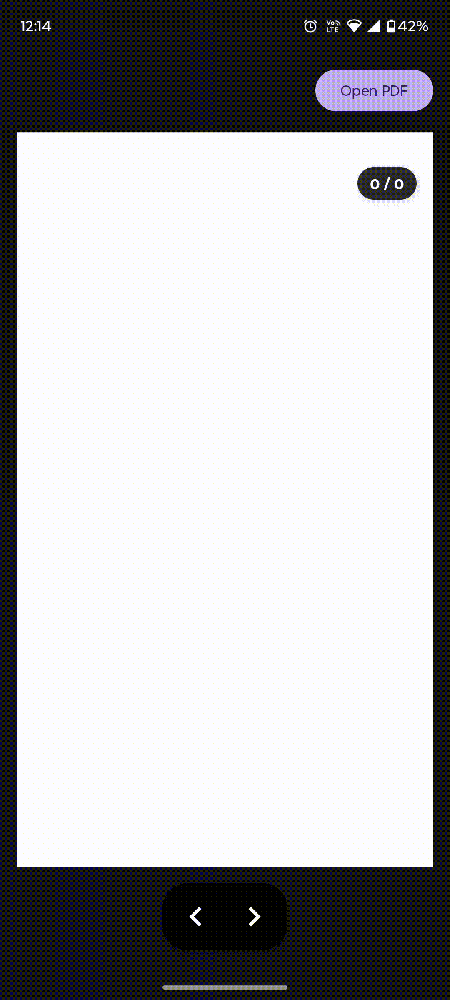

# PDF Viewer Library
[](https://kotlinlang.org/)
[](LICENSE)
[](#)
[](#)

**A lightweight, flexible, and customizable PDF Viewer library for Android** with multiple loading methods, swipe navigation, and full UI control for developers.

---

### Demo Video
<div align="center">
  
</div>

---

## Features

- **Multiple Loading Methods** – Load from File, URI, Assets, or Byte Array
- **Flexible Navigation** – Swipe gestures, button controls, or programmatic navigation
- **User-Controlled UI** – Implement your own buttons, page counter, and styling
- **Smooth Page Rendering** – Uses Android's native PdfRenderer
- **Page Change Listener** – Real-time callbacks for page updates
- **Customizable Layout** – Position and style controls however you want
- **No External Dependencies** – Pure Kotlin, lightweight, and fast

---

## Installation

### Add JitPack repository:

```gradle
// settings.gradle
dependencyResolutionManagement {
    repositories {
        maven { url 'https://jitpack.io' }
    }
}
```

### Add dependency:

```gradle
dependencies {
    implementation 'com.github.YourUsername:PDFBuilderViewer:1.0.0'
}
```

---

## Permissions

```xml
<uses-permission android:name="android.permission.READ_EXTERNAL_STORAGE" />
```

---

## Quick Start

### 1. Add PDFView to layout

```xml
<com.ext.pdf_builder_viewer.PDFView
    android:id="@+id/pdfView"
    android:layout_width="match_parent"
    android:layout_height="match_parent" />

<!-- Optional: Add your own navigation controls -->
<TextView
    android:id="@+id/pageNumberText"
    android:text="0 / 0" />

<ImageView
    android:id="@+id/prevButton"
    android:src="@drawable/ic_previous" />

<ImageView
    android:id="@+id/nextButton"
    android:src="@drawable/ic_next" />
```

### 2. Initialize in Activity

```kotlin
private lateinit var pdfView: PDFView

override fun onCreate(savedInstanceState: Bundle?) {
    super.onCreate(savedInstanceState)
    setContentView(R.layout.activity_main)

    pdfView = findViewById(R.id.pdfView)

    // Setup page change listener
    pdfView.setOnPageChangeListener(object : PDFView.OnPageChangeListener {
        override fun onPageChanged(currentPage: Int, totalPages: Int) {
            pageNumberText.text = "$currentPage / $totalPages"
            updateButtons()
        }
    })

    // Setup navigation
    prevButton.setOnClickListener { pdfView.showPreviousPage() }
    nextButton.setOnClickListener { pdfView.showNextPage() }
}

private fun updateButtons() {
    prevButton.isEnabled = pdfView.canGoPrevious()
    nextButton.isEnabled = pdfView.canGoNext()
}
```

### 3. Load PDF

```kotlin
// From File
val file = File("/path/to/document.pdf")
pdfView.fromFile(file).enableSwipeNavigation(true).load()

// From URI
val uri = Uri.parse("content://...")
pdfView.fromUri(uri).enableSwipeNavigation(true).load()

// From Assets
pdfView.fromAsset("sample.pdf").enableSwipeNavigation(true).load()

// From Bytes
pdfView.fromBytes(byteArray).enableSwipeNavigation(true).load()
```

---

## File Picker Integration

```kotlin
private val PICK_PDF_REQUEST = 1001

private fun openFilePicker() {
    val intent = Intent(Intent.ACTION_OPEN_DOCUMENT).apply {
        addCategory(Intent.CATEGORY_OPENABLE)
        type = "application/pdf"
    }
    startActivityForResult(intent, PICK_PDF_REQUEST)
}

override fun onActivityResult(requestCode: Int, resultCode: Int, data: Intent?) {
    super.onActivityResult(requestCode, resultCode, data)
    
    if (requestCode == PICK_PDF_REQUEST && resultCode == Activity.RESULT_OK) {
        data?.data?.let { uri ->
            contentResolver.takePersistableUriPermission(
                uri, Intent.FLAG_GRANT_READ_URI_PERMISSION
            )
            pdfView.fromUri(uri).load()
        }
    }
}
```

---

## API Reference

| Method | Description |
|--------|-------------|
| `fromFile(file: File)` | Load PDF from File |
| `fromUri(uri: Uri)` | Load PDF from URI |
| `fromAsset(name: String)` | Load PDF from assets |
| `fromBytes(bytes: ByteArray)` | Load PDF from bytes |
| `showNextPage()` | Go to next page |
| `showPreviousPage()` | Go to previous page |
| `setPageNumber(page: Int)` | Jump to specific page |
| `getCurrentPageNumber()` | Get current page |
| `getPageCount()` | Get total pages |
| `canGoNext()` | Check if next available |
| `canGoPrevious()` | Check if previous available |
| `enableSwipeNavigation(enable: Boolean)` | Enable/disable swipe |
| `setOnPageChangeListener(listener)` | Set page change callback |

---

## Usage Examples

### Minimal (Swipe Only)

```kotlin
pdfView.fromUri(uri).enableSwipeNavigation(true).load()
```

### Jump to Page

```kotlin
val pageNumber = editText.text.toString().toIntOrNull()
if (pageNumber != null && pageNumber <= pdfView.getPageCount()) {
    pdfView.setPageNumber(pageNumber)
}
```

### Save/Restore Position

```kotlin
// Save
val prefs = getSharedPreferences("pdf_prefs", MODE_PRIVATE)
prefs.edit().putInt("last_page", pdfView.getCurrentPageNumber()).apply()

// Restore
val lastPage = prefs.getInt("last_page", 1)
pdfView.setPageNumber(lastPage)
```

---

## Requirements

- **Minimum SDK:** 21 (Android 5.0)
- **Target SDK:** 34
- **Language:** Kotlin 1.8+

---

## License

```
MIT License

Copyright (c) 2025 Excelsior Technologies

Permission is hereby granted, free of charge, to any person obtaining a copy
of this software and associated documentation files (the "Software"), to deal
in the Software without restriction, including without limitation the rights
to use, copy, modify, merge, publish, distribute, sublicense, and/or sell
copies of the Software, and to permit persons to whom the Software is
furnished to do so, subject to the following conditions:

The above copyright notice and this permission notice shall be included in all
copies or substantial portions of the Software.

THE SOFTWARE IS PROVIDED "AS IS", WITHOUT WARRANTY OF ANY KIND, EXPRESS OR
IMPLIED, INCLUDING BUT NOT LIMITED TO THE WARRANTIES OF MERCHANTABILITY,
FITNESS FOR A PARTICULAR PURPOSE AND NONINFRINGEMENT. IN NO EVENT SHALL THE
AUTHORS OR COPYRIGHT HOLDERS BE LIABLE FOR ANY CLAIM, DAMAGES OR OTHER
LIABILITY, WHETHER IN AN ACTION OF CONTRACT, TORT OR OTHERWISE, ARISING FROM,
OUT OF OR IN CONNECTION WITH THE SOFTWARE OR THE USE OR OTHER DEALINGS IN THE
SOFTWARE.
```

---
